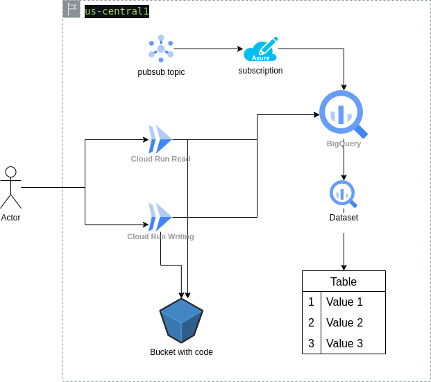

# devsecops
Latam
Nicolas Linares Patiño
Tel: +573057864514
Email: ing.nicolas.linares@gmail.com

## Parte 1: Infraestructura e IaC

1.  Identificar la infraestructura necesaria para ingestar, almacenar y exponer datos:

Para la primera parte, se eligió utilizar Cloud Run en GCP, creando dos funciones: una para leer y otra para escribir datos. Estas funciones exponen un endpoint HTTP que permite realizar peticiones. La selección de la base de datos fue un desafío; inicialmente consideré una base de datos NoSQL, pero al necesitar realizar analítica de datos, se optó por crear datasets en BigQuery y una tabla que se conecta con las funciones serverless. Así, el endpoint HTTP permite servir datos mediante métodos GET e ingresar datos con métodos POST.


2. (Opcional) Deployar infraestructura mediante Terraform de la manera que más te
acomode. Incluir código fuente Terraform. No requiere pipeline CI/CD.
 Para realizar el despliegue con infraestructura como código, se creó un pipeline en GitHub Actions. Este pipeline de Continuous Deployment (CD) nos permite implementar la infraestructura de manera automatizada.

El archivo de configuración para el CD se encuentra en la siguiente ruta: `.github/workflows/cd.yml`. Este archivo define los pasos necesarios para realizar el despliegue de la infraestructura, la definicion de la infraestructura esta en `infra/main.tf`


## Parte 2: Aplicaciones y flujo CI/CD

1. API HTTP: Levantar un endpoint HTTP con lógica que lea datos de base de datos y
los exponga al recibir una petición GET:

Acontinuacion podemos ver los endpoints funcionales para realizar las peticiones con ```curl```

**function_write:**

```bash
curl -X POST https://us-central1-grounded-primer-436816-b5.cloudfunctions.net/write_function \
-H "Content-Type: application/json" \
-d '{
    "name": "Test Name",       
    "flight": "AA123",
    "date": "2024-09-30"
}'
```
**function_read:**
```bash
curl -X GET https://us-central1-grounded-primer-436816-b5.cloudfunctions.net/read_function

```
**Test:**


2. Deployar API HTTP en la nube mediante CI/CD a tu elección. Flujo CI/CD y
ejecuciones deben estar visibles en el repositorio git.

Se realiza el despliegue de la infraestructura como código mediante un pipeline de GitHub Actions, como se puede ver en la siguiente imagen. Además, se evidencia la creación de las APIs de lectura y escritura junto con sus respectivas URLs.


3. (Opcional) Ingesta: Agregar suscripción al sistema Pub/Sub con lógica para ingresar
los datos recibidos a la base de datos. El objetivo es que los mensajes recibidos en
un tópico se guarden en la base de datos. No requiere CI/CD.

Para la ingesta de datos, intenté desplegar los siguientes recursos en Terraform, creando un tópico en Pub/Sub y una suscripción asociada:

```hcl
resource "google_pubsub_topic" "topic" {
  name = "topic-latam"
  labels = {
    foo = "bar"
  }

  message_retention_duration = "86600s"
}

resource "google_pubsub_subscription" "subscription-latam" {
  name  = "subscription-latam"
  topic = google_pubsub_topic.topic.id

  ack_deadline_seconds = 20

  # bigquery_config {
  #   table              = "${var.project}.${google_bigquery_dataset.my_dataset.dataset_id}.${google_bigquery_table.my_table.table_id}"
  #   use_table_schema   = true 
  #   write_metadata     = true  
  #   drop_unknown_fields = true  
  # }

  labels = {
    foo = "bar"
  }
}
```

Realicé la creación del tópico en Pub/Sub y traté de configurar la suscripción para que escribiera en mi tabla de BigQuery, pero encontré errores de permisos y no tuve tiempo suficiente para solucionarlos. La implementación no se completó, pero el objetivo es que los mensajes recibidos en el tópico se guarden en la base de datos.

4. Diagrama de Arquitectura




Notas: para aumentar la velocidad de desarrollo se usos el servicion serverless con un runtime de python se peude ver las fucniones en `backend/func1/main.py`, ademas de esto para estandarizar los ambientes de desarrollo se uso Dokcer para tener el mismos env, esto lo podemos ver en `.devcontainer/Dockerfile`

## Parte 3: Pruebas de Integración y Puntos Críticos de Calidad

1. Implementa en el flujo CI/CD en test de integración que verifique que la API
efectivamente está exponiendo los datos de la base de datos. Argumenta.

Para implementar el flujo de CI/CD, se añadió una prueba de integración E2E que verifica que la API efectivamente está exponiendo los datos de la base de datos. Esta prueba se encuentra al final del proceso de despliegue, en el archivo `tests/test_e2e.py`.

El test realiza lo siguiente: primero, envía una petición a los endpoints de las funciones para escribir un dato, comprobando que se recibe la respuesta correcta. Luego, procede a leer la tabla en la base de datos para confirmar que el dato fue correctamente almacenado. 

Si esta secuencia de pruebas se ejecuta exitosamente en el pipeline, significa que los cambios realizados no afectaron el comportamiento esperado de las APIs ni de la base de datos. Esto garantiza que el sistema continúa funcionando como se esperaba tras el despliegue.


2. Proponer otras pruebas de integración que validen que el sistema está funcionando
correctamente y cómo se implementarían.

Para asegurar que el sistema está funcionando correctamente, se proponen pruebas unitarias adicionales que validen que las modificaciones realizadas a las funciones no afecten su resultado esperado. Estas pruebas están alineadas con el modelo de diseño de dominio (DDD).

Se han implementado dos pruebas unitarias específicas, que se pueden encontrar en los archivos `tests/test_func1.py` y `tests/test_func2.py`. Estas pruebas verifican el comportamiento de las funciones en diferentes escenarios, asegurando que los cambios no introduzcan regresiones o errores en la lógica del sistema. 

De esta manera, se puede mantener la integridad del código y garantizar que el sistema siga funcionando de acuerdo a las expectativas, incluso tras futuras modificaciones.

Estas pruebas se corren en el CI.


3. Identificar posibles puntos críticos del sistema (a nivel de fallo o performance)
diferentes al punto anterior y proponer formas de testearlos o medirlos (no
implementar)

Al identificar posibles puntos críticos del sistema, se pueden considerar los siguientes aspectos a nivel de fallo y rendimiento:

 **Latencia de las APIs**: Es crucial medir el tiempo de respuesta de las APIs bajo diferentes cargas. Se pueden implementar pruebas de carga simulando múltiples usuarios concurrentes para evaluar cómo se comporta el sistema y detectar posibles cuellos de botella, podemos usar herramientas como grafana para validar lso tiempos y generar alertamientos.

 **Consumo de recursos**: Monitorear el uso de CPU y memoria de las funciones durante picos de tráfico y de la base de datos.

 **Escalabilidad del sistema**: Evaluar cómo se comporta el sistema al aumentar la cantidad de datos en la base de datos. Se pueden realizar pruebas para observar si la latencia aumenta y cómo afecta esto a la experiencia del usuario.

4. Proponer cómo robustecer técnicamente el sistema para compensar o solucionar
dichos puntos críticos

Para compensar o solucionar los puntos críticos identificados, se pueden considerar las siguientes estrategias:

 **Validación de la concurrencia de funciones**: Dado que estamos utilizando una arquitectura serverless, es fundamental configurar adecuadamente los límites de concurrencia en las funciones. Esto ayuda a evitar el agotamiento de recursos y a mantener un rendimiento óptimo bajo carga.

 **Uso de bases de datos transitorias**: Implementar una base de datos transitoria para manejar datos temporales y que sea mas fail y rapido realizar las consultas de los datos.


 **Implementación de caché**: Utilizar un sistema de caché (como Redis o Memcached) para almacenar datos frecuentemente accedidos puede disminuir la carga en la base de datos y mejorar los tiempos de respuesta de las APIs.

## Parte 4: Métricas y Monitoreo

1. Proponer 3 métricas (además de las básicas CPU/RAM/DISK USAGE) críticas para
entender la salud y rendimiento del sistema end-to-end

Latencia de las APIs: Mide el tiempo que tardan las solicitudes en ser procesadas por las APIs. Lo podemos hacer con grafana o hjerramientas similares que nos envien alertamiento.

Tasa de errores: Registra el porcentaje de solicitudes que resultan en errores (4xx y 5xx). si recibimos muchos de estos errores puede inidcar que el codigo fr la funcion esta mal o algo dentro de la fucntion.

Tiempo de respuesta de las consultas a la base de datos: Esta métrica nos permite evaluar cuánto tiempo tardan las consultas en ejecutarse bajo condiciones de demanda normal. Al monitorear estos tiempos de respuesta, podemos determinar si es necesario escalar la base de datos para manejar la carga de manera más eficiente.

2. Proponer una herramienta de visualización y describe textualmente qué métricas
mostraría, y cómo esta información nos permitiría entender la salud del sistema para
tomar decisiones estratégicas

Grafana puede mostrar mtricas como Latencia de las Apis, las tasas de errores de las funciones, el uso de los recursos de la infraestrucutra, tambien nos genera alertamientos que se pueden enviar a slack, teams entre otros.

3. Describe a grandes rasgos cómo sería la implementación de esta herramienta en la
nube y cómo esta recolectaría las métricas del sistema

Para poder implementar Grafana con GCP, AWS u otra nube, lo primero que se debe hacer es desplegar Grafana a través de Docker o Kubernetes. Luego, se debe realizar la conexión de Grafana con la nube, ya sea GCP u otra. Después, configuramos las métricas que queremos y las publicamos en tableros. Finalmente, podemos generar alertas y notificaciones, incluso un sistema de on-call.

4. Describe cómo cambiará la visualización si escalamos la solución a 50 sistemas
similares y qué otras métricas o formas de visualización nos permite desbloquear
este escalamiento.

No cambiaría mucho, ya que Grafana puede monitorear múltiples servicios al mismo tiempo de manera efectiva. Sin embargo, se necesitaría configurar adecuadamente los tableros para mostrar la información de manera clara. Esto nos permitiría obtener métricas como el promedio de latencia, la tasa de errores y el uso de recursos de todos los servicios en un los tableros de grafana, se podrían identificar patrones y tendencias a lo largo del tiempo, como fechas especiales entre otros para poder escalar nuestros servicios bien sea de manera horizontal o vertical. 

5. Comenta qué dificultades o limitaciones podrían surgir a nivel de observabilidad de
los sistemas de no abordarse correctamente el problema de escalabilidad.

Si no tenemos una buena observabilidad, será difícil identificar los cuellos de botella, ya que no se tiene visibilidad de la infraestructura. Al momento de presentarse un incidente, tendremos que hacer un troubleshooting completo para identificar el elemento que falla. Además de esto, con un correcto monitoreo no hay que esperar a que el producto manifieste errores, sino que serán detectados con las herramientas de monitoreo, lo que permitirá tomar decisiones con anterioridad.

## Parte 5: Alertas y SRE (Opcional)


1. Define específicamente qué reglas o umbrales utilizarías para las métricas
propuestas, de manera que se disparan alertas al equipo al decaer la performance
del sistema. Argumenta.


 - Latencia de las APIs Disparar una alerta si la latencia promedio de las APIs excede los 500 ms durante un periodo de 5 minutos.

 - Tasa de errores disparar una alerta si la tasa de errores (4xx y 5xx) excede el 5% del total de solicitudes en un periodo de 10 minutos.

 - Tiempo de respuesta de las consultas a la base de datos disparar una alerta si el tiempo de respuesta promedio de las consultas excede los 500 ms durante un periodo de 5 minutos, hay que evaluar los tiempo normales de las consultas de la base de datos para generar esta alerta.

 - Uso de recursos (CPU y RAM) disparar una alerta si el uso de CPU o RAM excede el 80% durante un periodo de 10 minutos.


2. Define métricas SLIs para los servicios del sistema y un SLO para cada uno de los
SLIs. Argumenta por qué escogiste esos SLIs/SLOs y por qué desechaste otras
métricas para utilizarlas dentro de la definición de SLIs.


**Métricas SLIs y SLOs**

 **SLI: Latencia de las APIs**
   - **SLO**: 95% de las solicitudes deben completarse en menos de 500 ms.
   - **Argumento**: un latencia muy elevada es malo para el usuario y la reputacion de la marca.

**SLI: Tasa de errores**
   - **SLO**: La tasa de errores (4xx y 5xx) debe ser menor al 4% de las solicitudes totales.
   - **Argumento**: Mantener una tasa de error baja es fundamental para generar alta confianza del usuario en la aplicación y garantizar la integridad entre todos los servicios, independientemente de la arquitectura utilizada, ya sea centralizada o distribuida, e incluso en el caso de contar con un servidor de eventos.


